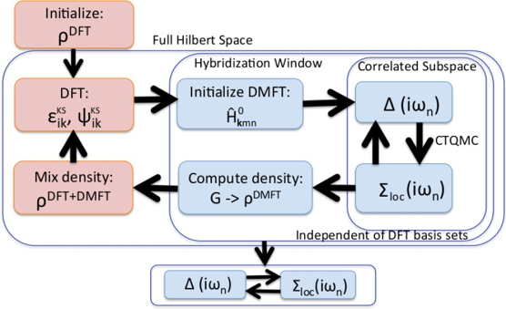

DMFTwDFT 
=========

DMFTwDFT is an open-source, user-friendly framework to calculate electronic, vibrational and elastic properties in strongly
correlated materials (SCM) using beyond-DFT methods such as DFT+U, DFT+Hybrids and DFT+DMFT (Dynamical Mean Field Theory) with a variety of different DFT codes. Currently supports VASP, Siesta and Quantum Espresso.

### Features <br />


### Workflow <br />



Installation and usage
----------------------

Please refer to the documentation.

https://dmftwdft-project.github.io/DMFTwDFT/

**Quick Install:**

Copy Makefile.in from the ``config`` directory for the desired compiler to the DMFTwDFT root directory and do:

```bash
 python setup.py {gfortran, intel}
```

Note:

For gnu compilers, it is assumed that liblapack.a, libblas.a and gsl libraries are installed in the ``/usr/local/lib/`` directory. If not, modify Makefile.in to point to the correct location.

Developers
-----------

Hyowon Park <br />
Aldo Romero <br />
Uthpala Herath <br />
Vijay Singh <br />
Benny Wah <br />
Xingyu Liao <br />

Contributors
------------
Kristjan Haule <br />
Chris Marianetti <br />

How to cite
-----------

If you have used DMFTwDFT in your work, please cite:

[10.1016/j.cpc.2020.107778](https://www.sciencedirect.com/science/article/abs/pii/S001046552030388X)

BibTex:

    @article{SINGH2021107778,
    title = "DMFTwDFT: An open-source code combining Dynamical Mean Field Theory with various density functional theory packages",
    journal = "Computer Physics Communications",
    volume = "261",
    pages = "107778",
    year = "2021",
    issn = "0010-4655",
    doi = "https://doi.org/10.1016/j.cpc.2020.107778",
    url = "http://www.sciencedirect.com/science/article/pii/S001046552030388X",
    author = "Vijay Singh and Uthpala Herath and Benny Wah and Xingyu Liao and Aldo H. Romero and Hyowon Park",
    keywords = "DFT, DMFT, Strongly correlated materials, Python, Condensed matter physics, Many-body physics",
    }

Thank you. 

Mailing list
-------------
Please post your questions on our forum.

https://groups.google.com/d/forum/dmftwdft

Support packages
----------------
We acknowledge the use of the following packages:

-   [PyProcar](https://github.com/uthpalah/PyProcar)<br />

Uthpala Herath, Pedram Tavadze, Xu He, Eric Bousquet, Sobhit Singh, Francisco Muñoz, and Aldo H. Romero. "PyProcar: A Python library for electronic structure pre/post-processing". Computer Physics Communications 251 (2020): 107080.

-   [PyChemia](https://github.com/MaterialsDiscovery/PyChemia)

-   [Continuous time Quantum Monte Carlo (ctqmc)](http://hauleweb.rutgers.edu/tutorials/Tutorial0.html)<br>

  [1] Kristjan Haule, Phys. Rev. B 75, 155113 (2007).

Free energy implementation :
  [2] Kristjan Haule, Turan Birol, Phys. Rev. Lett. 115, 256402 (2015).

-   [Wannier90](http://www.wannier.org/)<br>
    Wannier90 as a community code: new features and applications, G. Pizzi et al., J. Phys. Cond. Matt. 32, 165902 (2020) 

**Note:**

Users can download these external programs, as explained in the README file of each supported package folder (see folder DMFTwDFT-master/support-packages). For installation, we suggest users refer to this link: https://dmftwdft-project.github.io/DMFTwDFT/installation.html for more details. 
OR Users can run the python script "setup.py" which will automatically download and install the internal as well as external programs.

PyProcar is used as a support package to find the wannier window of the correlated orbitals. It's not necessary to be installed for DMFTwDFT.
PyChemia is required for the Python 3 version of the code which is still under development. 
For the Python 2 version this is not required. 

Changes
-------
v1.2 Jan 13th, 2020 - Fixed bug with exponentially large numbers in UNI_mat.dat for SCF calculations. <br />
v1.1 May 11th, 2020 - Added support for Quantum Espresso through Aiida. <br />
v1.0 April 23, 2020 - Cleaned repository. Defaulted to Python 2.x version. <br />
v0.3 November 25, 2019 - Added DMFT.py and postDMFT.py scripts <br />
v0.2 July 10, 2019 - DMFTwDFT library version <br />
v0.1 July 31, 2018 - Initial release (Command line version)


