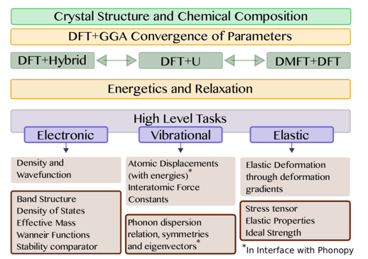
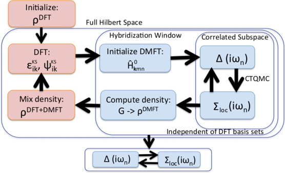

DMFTwDFT
===========

DMFTwDFT is an open-source, user-friendly framework to calculate electronic, vibrational and elastic properties in strongly
correlated materials (SCM) using beyond-DFT methods such as DFT+U, DFT+Hybrids and DFT+DMFT (Dynamical Mean Field Theory) with a variety of different DFT codes.

### Structure   

### Workflow   

Installation and usage
----------------------

Please refer to the documentation.

https://romerogroup.github.io/DMFTwDFT/ 

Contributors
------------
Hyowon Park  
Aldo Romero  
Kristjan Haule  
Chris Marianetti  
Uthpala Herath  
Vijay Singh  
Benny Wah  

Support packages
----------------
[PyProcar](https://github.com/uthpalah/PyProcar)
 
[PyChemia](https://github.com/MaterialsDiscovery/PyChemia)

Mailing list
--------------
Coming soon...

Changes
-------
v1.0 July 31, 2018 - Initial release (Command line version)

v2.0 July 10, 2019 - DMFTwDFT library version

	
